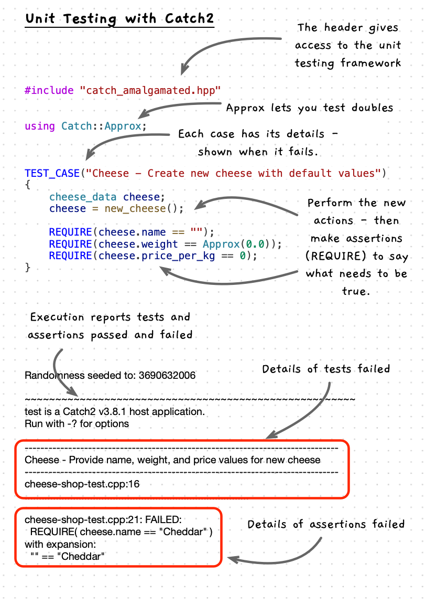

As you start to build larger programs, finding issues can become a bigger challenge, particularly when you work with others. One strategy we can use to tackle this is to create small tests alongside our program as it develops. These tests will check the functionality of individual part of the code, using a technique called **unit testing**.

With unit testing you pick a single, small, piece of functionality to tests at a time and create code that allows you to run this test frequently as your continue to develop your program. This will help identify issues as they arise, which may otherwise go unnoticed.

Test driven development takes this idea a little further with the idea of writing these unit tests *before* you write the model code that you are testing. This can be a great way to think through how the model should work, as you write the code to use the new feature before writing the feature itself.

We will have a look at unit testing and test driven development in the guided tour using the C++ [Catch2 library](https://github.com/catchorg/Catch2). To use this you need to add the following code to create your test executable. Download the testing framework code:

- [catch_amalgamated.hpp](https://raw.githubusercontent.com/catchorg/Catch2/refs/heads/devel/extras/catch_amalgamated.hpp)
- [catch_amalgamated.cpp](https://raw.githubusercontent.com/catchorg/Catch2/refs/heads/devel/extras/catch_amalgamated.cpp)

:::tip
We are only touching on the ideas of unit testing, and testing in general. This is something you can explore further as you continue your studies. At this stage we want only to start using these tools, and encourage you to consider engaging with this more deeply in the future.
:::

## Example

The following is an example of a small unit test we can code in **catch-test.cpp**:

```cpp
#include <math.h>
#include "catch_amalgamated.hpp"

using Catch::Approx;

// You need something to test. Here is a simple angle calculator:

/**
 * Calculate the angle between two points in degrees.
 * 
 * @param x1 The x-coordinate of the first point.
 * @param y1 The y-coordinate of the first point.
 * @param x2 The x-coordinate of the second point.
 * @param y2 The y-coordinate of the second point.
 * @return double the angle in degrees.
 */
double calculate_angle(double x1, double y1, double x2, double y2)
{
    // should be: double angle = atan2(y2 - y1, x2 - x1) * (180 / M_PI);
    double angle = atan2(y1 - y2, x2 - x1) * (180 / M_PI);
    return angle;
}

// Test cases for the angle calculator

TEST_CASE("Angle Calculation - Basic Test")
{
    double angle = calculate_angle(0, 0, 1, 1);
    REQUIRE(angle == Approx(45.0));
}
```

To compile and run this using:

```sh
clang++ catch-test.cpp catch_amalgamated.cpp -o test
./test
```

This will output something like this, helping you locate and correct issues as they occur.

```txt
Randomness seeded to: 3288016061

~~~~~~~~~~~~~~~~~~~~~~~~~~~~~~~~~~~~~~~~~~~~~~~~~~~~~~~~~~~~~~~~~~~~~~~~~~~~~~~
test is a Catch2 v3.8.1 host application.
Run with -? for options

-------------------------------------------------------------------------------
Angle Calculation - Basic Test
-------------------------------------------------------------------------------
catch-test.cpp:24
...............................................................................

catch-test.cpp:27: FAILED:
  REQUIRE( angle == Approx(45.0) )
with expansion:
  -45.0 == Approx( 45.0 )

===============================================================================
test cases: 1 | 1 failed
assertions: 1 | 1 failed
```
