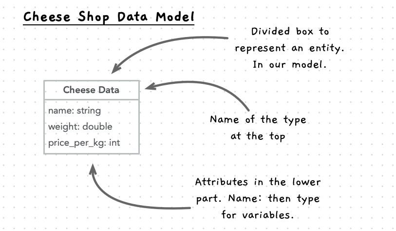
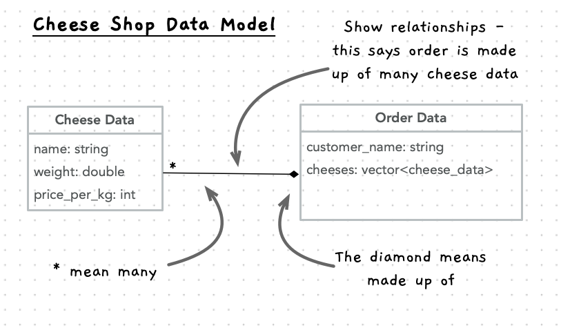
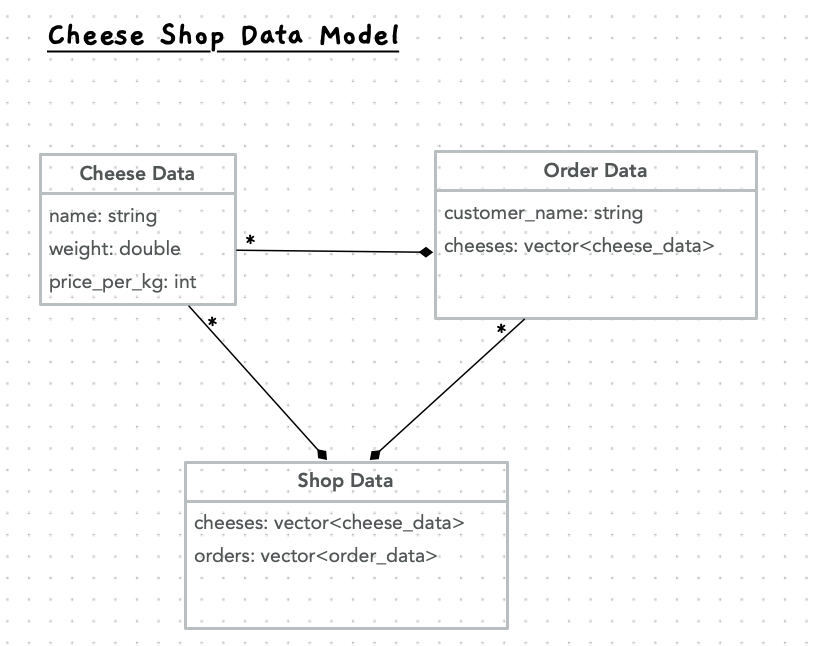

The first step we should do is to think up how we want to model the entities/data within our program. Remember that the way you organise these entities will greatly impact how your code works, so spending a little time to think about these now should help you see how the program will come together in the end.

:::tip

As we transition into object-oriented programming, we will combine the data and functionality into objects (coded using classes) as we explored in the [Member Functions](/book/part-2-organised-code/7-member-functions/0-overview) chapter. For the moment, focus on the *entities* and this should help set the foundation for objects when we look at them more specifically. For now, focus on how you want to organise the data using structs and enumerations.

:::

## Picturing the data

When I think about the cheese shop, there seem to be some fairly obvious entities we will want to work with. This should usually be the case, as when you talk with users or imagine a program yourself, there are usually some clear entities (things) involved. The two main entities that come to mind are:

1. Cheese
2. Orders

If we then think about the program a little more, we should see that we need a way of managing multiple cheeses and orders within the cheese shop. We can extend our model to include the shop itself:

3. Cheese Shop

Within the shop we will need to track multiple cheese or order values. For this you can use your dynamic array () or you can use the [vector](/book/part-2-organised-code/10-project/0-panorama/4-cpp-utilities/#vector) class from the standard C++ library. Either way, this will help to take care of managing memory needed to work with these.

Now let's capture our ideas before we move on to think about how we use these entities.

### Cheese

We can create an entity to represent the cheeses that are in stock or ordered by customers. When determining what this should contain you can review the specification, details captured from a client or system description, or your own imagination (if you are inventing the program by yourself). In our case we will need:

- Name of the cheese
- Cost of the cheese per kilogram
- Weight of the cheese in kilogram

With the different values identified, next we need to identify the types for these. The *name* will be a `string` as this is textual information. The *weight* can be coded as a `double` as we may have orders and stock values that are not always rounded to whole kilograms. The *cost* can then be coded as an `int`, storing the cost per kilogram in cents. We don't use a `double` here as these include rounding errors which we want to avoid in our financial calculations.

We can visualise this as shown below. This is a UML diagram, where we are showing the details about the entities in our model. The one divided box shows the *Cheese Data* entity, that contains three attributes, listed in the lower box. For the attributes, UML expresses these using the name of the attribute and then its type, separated by a `:`. So the name attribute will be `name: string` in the UML.

:::tip
Remember this is at a higher level than the code you create. So you can have spaces in names if you want. Generally I use Title Case for the main entities, but use something closer to the actual code name for the attributes.
:::

### Order

An order will have a customer (just their name for now) and a list of cheeses. The customer will need to be able to specify the amount of each cheese, and we can record the current cost so that we can calculate the cost for each cheese and the total cost for the order.

Our order entity will contain the following fields:

- Customer name (a string)
- Cheeses (a dynamic array or vector of type cheese data)

This can be captured visually as shown below. We can show a line between the order and cheese data entities to indicate they are related. The line can include a diamond on the side of the order to indicate we think of the cheese as part of the order (or that the order is made up of cheese). We will explore this in more detail when we look at the object-oriented concepts in the next part, for now we want you to be able to read this diagram to help see how to think about the entities.

### Cheese Shop

Like with the order, the cheese shop contains cheese, but it will also contain a number of orders.

Our cheese shop entity will contain the following fields:

- Cheeses (a dynamic array or vector of cheese data)
- Orders (a dynamic array or vector of order data)

