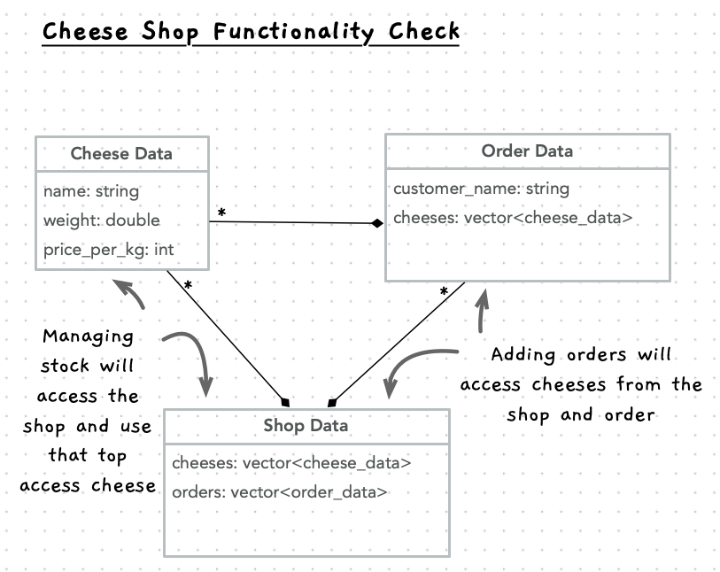

Now we have a plan for our data, the next step is to plan out the functionality for the program. This will use the knowledge of our data model to make sure that each function/procedure has the necessary information to achieve its task.

At this point we want to get some validation that our model is sufficient, and get some basic ideas for the kinds of actions that we need to perform. We can iteratively build this out once we can see that the current design should allow us to build the main functionality.

## Identify main functionality

In thinking through the entities, we should also be thinking about the actions that we want performed on the model. For our cheese shop we will have the following main actions:

- Cheese management - actions related to the management of cheese within the shop.
- Order management - creating and fulfilling orders.

Cheese management can operate on the shop data - giving it access to the list of cheeses and the ability to add and remove elements from this list. We will need several functions to manage this, and they can operate on individual cheese data values or on the shop as needed.

Order management will need access to the shop to identify available stock, and to add and manipulate orders. When we create an order, the shop can be used to determine the cheese we can add to the order and to set the price of cheese when the order is placed.

This should give us some certainty that the model is sufficient, and we can start building up some of this functionality.

:::tip

Model reflection of the real world can also help give you confidence. If you can clearly see the real world entities within your model then it is likely to be on the right track.

:::
