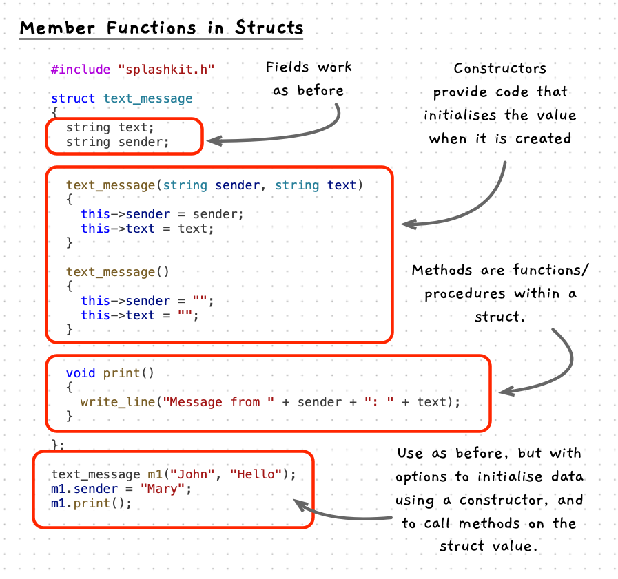

So far, structs have only contained data fields. This made it easy to collect together the pieces of data associated with an entity. The usefulness of the idea of consolidating things within an entity eventually resulted in the idea of also embedding the functionality alongside the data *within* the entity. This became the *object-oriented paradigm*, which is the focus of [Part 3](/book/part-3-programs-as-concepts/00-part-3-programs-as-concepts).



:::note[A struct:]

 - can contain fields (data members) as we have seen before.
 - can also contain **methods** - the term we use for functions/procedures within a struct.
 - may have **constructors** - special methods called when a value of the struct is created.

When using a struct with member functions:

- a constructor is called when you declare the variables.
- you can access the data fields.
- you can call methods on the struct values.

:::

## Example

The following example code creates a text message struct with:

- 2 constructors: one that takes 2 parameters (the name and message) and another with no parameters.
- 1 method: print.

In main, we create several values from the struct, using the constructor to set initial field values, and using the print method to output the details.

```cpp {3-57}
#include "splashkit.h"

/**
 * @struct text_message
 * @brief Represents a simple text message with a sender and message text.
 * 
 * @field text The content of the message.
 * @field sender The sender of the message.
 */
struct text_message
{
  /**
   * The content of the message.
   */
  string text;

  /**
   * The sender of the message.
   */
  string sender;

  /**
   * @brief Constructs a text_message with the given sender and text.
   * 
   * @param sender The sender of the message.
   * @param text The content of the message.
   */
  text_message(string sender, string text)
  {
    // within the struct, this refers to value we are called on
    // here we need to use this-> to refer to the fields as
    // the parameters have the same name
    this->sender = sender;
    this->text = text;
  }

  /**
   * @brief Constructs an empty text_message with no sender or text.
   */
  text_message()
  {
    // A default constructor lets you initialise the value when no parameters
    // are passed
    // We can access sender and text directly, or using this->
    sender = "";
    text = "";
  }

  /**
   * @brief Prints the message in the format: "Message from <sender>: <text>"
   */
  void print()
  {
    // You can access the fields directly here - also accessible via this->field
    write_line("Message from " + sender + ": " + text);
  }
};


/**
 * @brief Entry point for the message program. Demonstrates usage of the
 * text_message struct.
 */
int main()
{
  text_message m1("John", "Hello");
  text_message m2("Mary", "Hi");
  text_message m3("John", "How are you?");
  text_message m4("Mary", "I'm good thanks");
  text_message m5;

  m1.print();
  m2.print();
  m3.print();
  m4.print();
  m5.print();

  // Values can also be on the heap
  text_message *m6 = new text_message("John", "I'm glad to hear it");
  m6->print();
  delete m6;

  return 0;
}
```

:::note

Notice how this helps direct our focus to the entity - it now has data and can perform actions. We are calling print on the message, rather than passing the message to a procedure that prints it. We are creating more powerful entities.

:::
