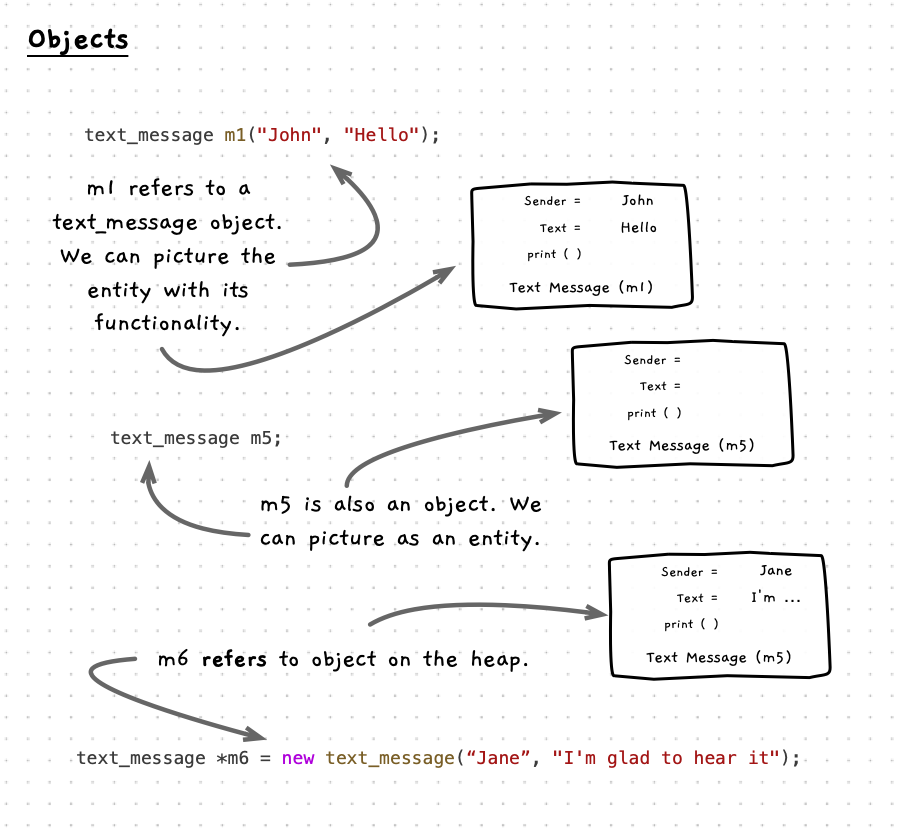

Once we start working with member functions, we are moving into object-oriented programming. So...

*What are objects?*

The values we create from a struct with member functions are known as **objects**.



:::note[Objects:]

- is the term we give to values created from structs with member functions.
- may exist on the stack or heap in C++ (but usually on the heap in other languages).

:::

## Example

The following code creates seven text_message objects. The variables `m1` to `m5` are each an object on the stack, which in C++ you interact with using the dot operator (`.`). The `m6` variable is a pointer that can point to a `text_message` object. We initially create one message object, and interact with it, before deleting it. We can then reuse that pointer and create a new `text_message` object for it to refer to.

```cpp {33-34,36-37,39-42,44-49,51-53,55-57,59-60,62-64}
#include "splashkit.h"

struct text_message
{
  string text;   ///< The content of the message.
  string sender; ///< The sender of the message.

  text_message(string sender, string text)
  {
    this->sender = sender;
    this->text = text;
  }

  text_message()
  {
    sender = "";
    text = "";
  }

  void print()
  {
    write_line("Message from " + sender + ": " + text);
  }
};

/**
 * @brief Entry point for the message program. Demonstrates usage of the
 * text_message struct.
 */
int main()
{
  // Create a text_message object - m1 - on the stack. It has name "John" and text "Hello"
  text_message m1("John", "Hello");

  // Create a text_message object - m2 - on the stack. It has name "Mary" and text "Hi"
  text_message m2("Mary", "Hi");

  // m3, m4, and m5 are also text_message objects
  text_message m3("John", "How are you?");
  text_message m4("Mary", "I'm good thanks");
  text_message m5;

  // You can interact with the objects...
  m1.print(); // ask m1 to print itself
  m2.print(); // ask m2 to print itself
  m3.print();
  m4.print();
  m5.print();

  // Objects can also be on the heap... in this case m6 is a pointer to the object.
  // the object itself is on the heap
  text_message *m6 = new text_message("John", "I'm glad to hear it");

  // With pointer, use the -> operator to interact with the object
  m6->print();  // ask the object that m6 points to, to print itself
  delete m6; // now destroy the object that m6 refers to...
  
  // The object referred to by m6 no longer exists... but
  m6 = NULL; // m6 still exists - it is a pointer. We can change it to point to null now.

  // We can even create another object for m6 to refer to
  m6 = new text_message("Ye", "Howdy");
  delete m6;

  return 0;
}
```

:::note

The term object is used to refer to values created from the struct. This makes it easier to talk about these values, and we can now talk about interacting with an object, using an object, creating an object, etc.

:::
