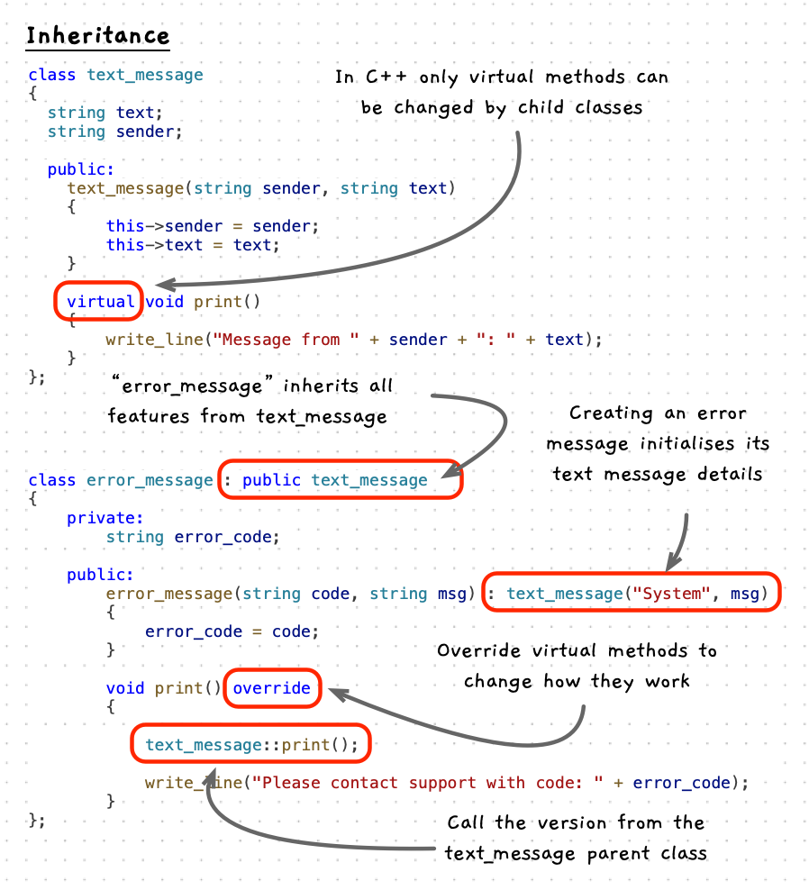

With classes (and structs in C++) we can now create objects that contain data and functionality. This different way of thinking about organising our code led to a new programming capability: *inheritance*.

Inheritance lets you create a class that *inherits* all the features from a *parent* class. The *child* class can then add additional features (methods and/or fields) and change (override) existing methods. This can be a very useful tool to help avoid repetition, but also in creating a *family* of related classes that all have similar features.

:::note

We will explore inheritance much more in Part 3, for the moment we will focus just on the mechanics of how this works.
:::



:::note

- Inheritance allows you to create a class that inherits all features from another class (its parent class).
- In the child class, you can add new features and override any virtual methods (changing how they work on objects created from this class).
- Inheritance is used to create a hierarchy of classes.
- Inheritance involves generalisation/specialisation - more specific classes inhert features from the more general classes. In this way, more general/common features from the parent are inherited across all child classes.
- The term *base class* can be used to describe a class from which other classes inherit. In our example, the `text_message` is a the base class from which `error_message` inherits.

:::

## Example

The error message class is a kind of text message used to send system errors. Using inheritance, the error message class inherits all the features of a log message (so it has a sender and message text). The `error_message` class adds an error code field, a different constructor, and changes the way the print method works.

```cpp {55-73,85-110,119-120,123-124}
#include "splashkit.h"

/**
 * @class text_message
 * @brief Represents a simple text message with a sender and message text.
 *
 * @field text The content of the message.
 * @field sender The sender of the message.
 */
class text_message
{
  /**
   * The content of the message. This is now private!
   */
  string text;

  /**
   * The sender of the message. This is now private!
   */
  string sender;

  // Things from here on are public now...
  public:
    /**
     * @brief Constructs a text_message with the given sender and text.
     *
     * @param sender The sender of the message.
     * @param text The content of the message.
     */
    text_message(string sender, string text)
    {
        this->sender = sender;
        this->text = text;
    }

    /**
     * @brief Constructs an empty text_message with no sender or text.
     */
    text_message()
    {
        sender = "";
        text = "";
    }

    /**
     * @brief Prints the message in the format: "Message from <sender>: <text>"
     * 
     * This method is virtual, allowing derived classes to override it.
     */
    virtual void print()
    {
        write_line("Message from " + sender + ": " + text);
    }

    /**
     * @brief Gets the sender of the message.
     *
     * @return string The sender of the message.
     */
    string get_sender()
    {
        return sender;
    }

    /**
     * @brief Get the text of the message.
     * 
     * @return string The content of the message.
     */
    string get_text()
    {
        return text;
    }
};

/**
 * @class error_message
 * @brief Represents an error message that extends text_message with an error code.
 * 
 * @field error_code The code associated with the error.
 * 
 * All error message are sent by the system, so the sender is hardcoded to "System".
 * When printed, it includes the error code in the output.
 */
class error_message : public text_message
{
    private:
        string error_code;

    public:
        /**
         * @brief Constructs an error_message with a specific error code and message.
         *
         * @param code The error code associated with the error.
         * @param msg The message describing the error.
         */
        error_message(string code, string msg) : text_message("System", msg)
        {
            error_code = code;
        }

        /**
         * @brief Overrides the print method to include the error code.
         */
        void print() override
        {
            text_message::print();
            write_line("Please contact support with code: " + error_code);
        }
};

int main()
{
    text_message msg("Sender", "This is a message");
    msg.print();

    write_line();

    error_message err("404", "This is an error message");
    err.print();

    // We can also access inherited methods
    write_line("Sender of error message: " + err.get_sender());
    write_line("Text of error message: " + err.get_text());

    return 0;
}
```

This will output:

```sh
Message from Sender: This is a message

Message from System: This is an error message
Please contact support with code: 404
Sender of error message: System
Text of error message: This is an error message
```

:::note

- Notice how the error message class does not define a text or sender field. It inherits these from the text message parent class.
- Objects of the error message class will have sender, text, and error code fields, as well as a print method.
- Print must be marked as virtual to allow the error message class to override it.
- You can think of the error message as building on the base set by text message.

:::
