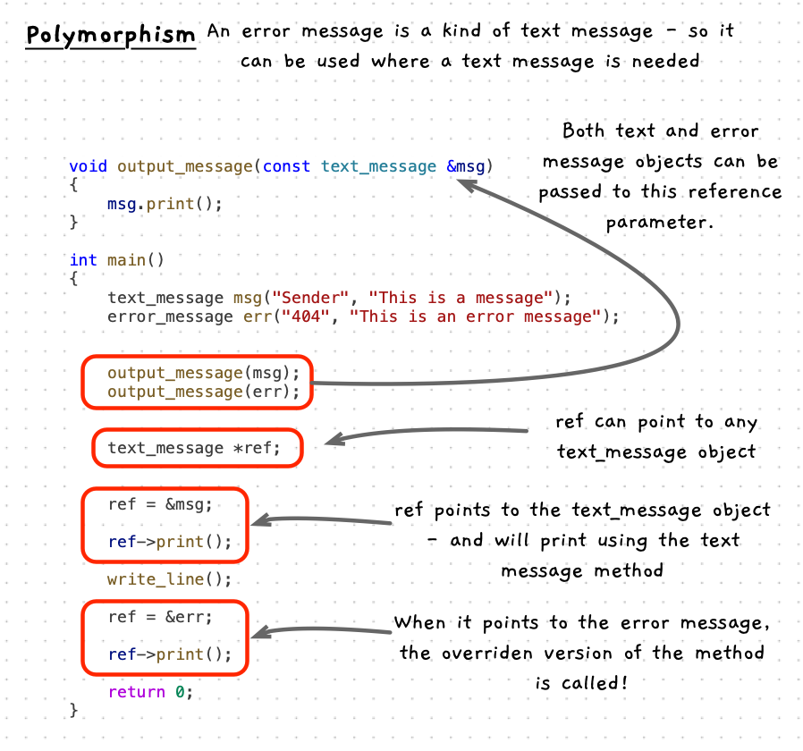

In programming, polymorphism means *many forms* and refers to the ability to use symbols/methods with different types. For example, at an operator level the symbol `+` can be used to work with integers, floating point values, and strings. So the one operator works with *many forms* of data. [Overloading](/book/part-2-organised-code/2-organising-code/2-trailside/09-overloading) is another example of polymorphism, where a given function/procedure/method name can accept different parameters.

Object-oriented programming and inheritance opens up a new opportunity for polymorphism. With inheritance, we can create families of related types where child classes inherit all the features of their parent class. In this case, we know that any object of a child class *must* have all features (fields, methods, etc) of the parent. As a result, objects of the child-class can be used anywhere an object of the parent class is needed.



:::note

- With inheritance, the child class has inherited the features of the parent class. Therefore, any object of the child class can be used anywhere the parent is required. After all, it has all the required features.
- Virtual methods include a lookup step, so that the actual method called will depend on the object. So calling print on a `text_message` reference will actually call the print method on the `error_message` class if the object is an `error_message`.
- This ability to override methods is usually what people are referring to when they talk about polymorphism - though there are other forms of polymorphism.
- In C++, you will need to use references or pointers to achieve this, as otherwise you have only the fixed space allocated to the class used to declare the variable.
- In this context, the reference can refer to *many forms* of objects -- objects from the class itself, or from any child class that inherits from the class.

:::

## Example

The following example shows the use of polymorphism with the `text_message` and `error_message` from the previous [inheritance](/book/part-2-organised-code/7-member-functions/0-panorama/03-inheritance) example. Here we have added a method that accepts a reference to a `text_message`. Notice that we can pass this method either a `text_message` or an `error_message` object. Similarly, we have a pointer `ref` in main that can be used to point to either object. In both cases, when you call `print` the object will choose the method to run. The `error_message` objects will run the code from the `error_message` class, as this method is overloaded.

```cpp {29-32,36-57}
#include "splashkit.h"

/**
 * @class text_message
 * @brief Represents a simple text message with a sender and message text.
 *
 * @field text The content of the message.
 * @field sender The sender of the message.
 */
class text_message
{
    //... as before
};

/**
 * @class error_message
 * @brief Represents an error message that extends text_message with an error code.
 * 
 * @field error_code The code associated with the error.
 * 
 * All error message are sent by the system, so the sender is hardcoded to "System".
 * When printed, it includes the error code for support reference.
 */
class error_message : public text_message
{
    //... as before
};

void output_message(const text_message &msg)
{
    msg.print(); // Calls the print method of the text_message class
}

int main()
{
    text_message msg("Sender", "This is a message");
    error_message err("404", "This is an error message");

    // You can pass both objects to a method expecting a text_message reference
    output_message(msg);
    output_message(err);

    // Create a pointer to a text_message...
    text_message *ref;
    
    // Point ref to the text_message instance
    ref = &msg;

    ref->print(); // Calls the print method from the text_message class

    write_line();

    ref = &err; // Now point ref to the error_message instance

    ref->print(); // Calls the overridden print method in error_message

    return 0;
}
```

Polymorphism adds a whole new dimension to how you can design your programs. We will work up to this in Part 3, where object-oriented design will be the focus.
