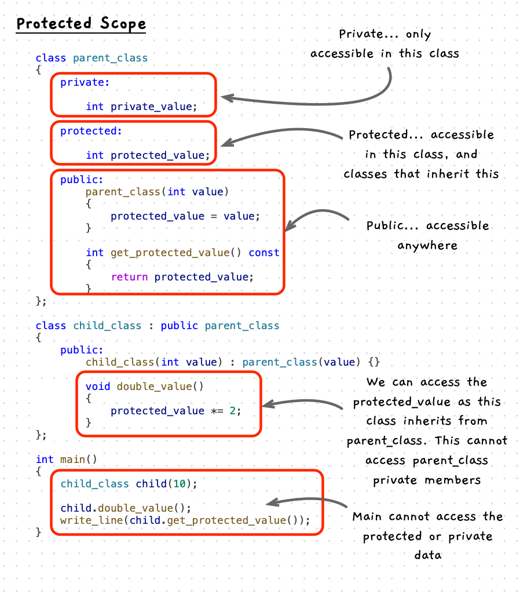

Object-oriented programming has opened up new [scoping](/book/part-1-instructions/3-control-flow/2-trailside/02-1-scope) options -- with the ability to mark struct and class members as either *public* or *private*. With inheritance, we open up further opportunities in this space.

When defining a struct or class, we have seen that you can indicate if members are public or private. Public members are accessible outside the class, while private members are only accessible within the class or struct's code. In this context, a child class will only be able to access *public* members of its parent class -- even though these members are part of the object itself.

When designing a class, you may want some members to be accessible to child classes while keeping it private from other code. To achieve this, languages usually offer an additional scoping modifier: *protected*. A protected struct/class member is accessible within its class and all child classes, but is not accessible from other code.



:::note

Scope modifiers allow you to indicate which code has access to the members you create within a class (or struct).

- Public members are accessible anywhere in the code. If you have access to an object of this type (or of a type that inherits from this type) then you can access this member (field or method).
- Protected members are accessible from the current class, and any other classes that inherit from this class.
- Private members are only accessible from within the current class.

:::

## Example

The following code illustrates the use of the different scope modifiers.

```cpp
#include "splashkit.h"

using std::to_string;

class parent_class
{
    private: 
        // Private members cannot be accessed by child classes
        int private_value;
        
    protected:
        // Protected members are accessible in this class, and in
        // the child_class as it inherits from this class
        int protected_value;

    public:
        // Public members are accessible anywhere in the code

        parent_class(int value)
        {
            protected_value = value;
        }

        // You can add things like accessor methods to give access
        // to private and protected values in a controlled way.
        // Here we can only read the protected value publicly
        // as we only have a method to get the value.
        int get_protected_value() const
        {
            return protected_value;
        }
};

class child_class : public parent_class
{
    public:
        child_class(int value) : parent_class(value) {}

        void double_value()
        {
            // Here we can access the protected value...
            // this class inherits from parent_class so the field
            // is in scope
            protected_value *= 2; 
        }
};  

int main()
{
    // We can construct a child_class object as the constructor is public.
    child_class child(10);

    // You cannot access protected_value directly here! So child.protected_value 
    // will not work.
    // Nor can you access the the private data. So child.private_value will not
    // work.

    // But we can use public members...
    child.double_value(); // Double the protected value
    write_line(
        "Protected value after doubling: " + 
        to_string(child.get_protected_value())
    );
}
```
